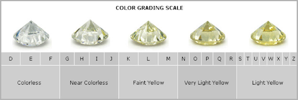
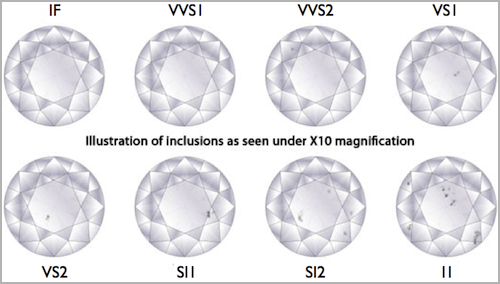

```{r setup, include=FALSE}
knitr::opts_chunk$set(echo = TRUE)
```

Diamond prices are driven by 4Cs: carat, cut, color, and clarity. In this assignment you'll explore a dataset containing the prices and other attributes of almost 54,000 diamonds.

### Accessing the data

The data can be found in the `ggplot2` package.

Load the package with

```{r eval=FALSE}
library(ggplot2)
```

and load the data with

```{r eval=FALSE}
data(diamonds)
```

Take a peek at the codebook with

```{r eval=FALSE}
?diamonds
```

or at http://ggplot2.tidyverse.org/reference/diamonds.html.

### More about the data

The figure below can be helpful for understanding what the variables in the dataset mean.


Carat is a unit of mass equal to 200 mg and is used for measuring 
gemstones and pearls. Cut grade is is an objective measure of a 
diamond's light performance, or, what we generally think of as sparkle.

The figures below shows color grading of diamonds.


Lastly, the figure below shows clarity grading of diamonds:




### Accessing the assignment repo

Go to the #assignment-links channel on Slack and click on the link for mini-hw-07, and accept the assignment. Note that this is an individual assignment.

### Assignment

1. What type of variable is price? Would you expect its distribution to be symmetric, right-skewed, or left-skewed? Why? Make a histogram of the distribution of diamond prices. Does the shape of the distribution match your expectation?

Answer each of the following in a single pipe. You do not need to provide any interpretations, only the code and output is sufficient.

2. How many diamonds of each type of cut are there?

3. Calculate the relative frequency of each clarity of diamonds.

4. Plot the relationship between depth and price of only fair cut diamonds.

5. For each type of cut, calculate minimum (`min`), maximum (`max`), mean (`mean`), and median (`median`) price of diamonds of that type.

### Grading

Total                                                   | 15 pts
--------------------------------------------------------|--------
Questions 2 - 4                                         | 2 pt / question - 6 pts
Questions 1 and 5                                       | 3 pts / question - 6 pts
Code style and informatively named code chunks          | 1 pt
Commit frequency and informative messages               | 1 pt
Overall organization                                    | 1 pt
