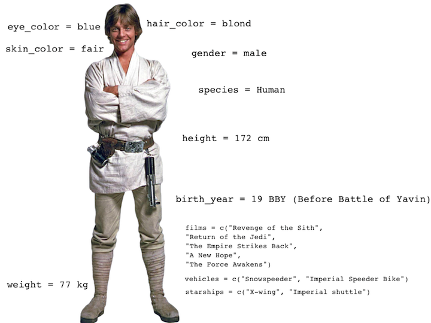
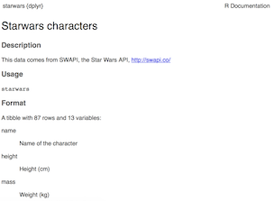

# Getting started

## Follow up from last time...

- Any questions on material from last time?

- Any questions on homework?

- Any questions on workflow / course structure?
    
- Catch up on informal "requirements":
    + Did everyone download the Slack app?
    + Did everyone adjust their Slack username to be/include their (preferred) first name?
    + Did everyone add their photo to the GitHub and Slack profiles?

## R in a nutshell

Functions in R are often verbs, and then in parantheses are the arguments for those functions.

```{r eval=FALSE}
verb(what-you-want-to-apply-verb-to, other-arguments)
```

For example:

```{r eval=FALSE}
glimpse(gapminder)      # Glimpse into the gapminder dataset
```

```{r eval=FALSE}
gapminder %>%           # Pipe into the next function
  filter(year == 1952)  # Filter if year is equal to 1952
```

# Data visualization

## Data visualization

> *"The simple graph has brought more information to the data analyst’s mind than any other device." — John Tukey*

- Data visualization is the creation and study of the visual representation of data.

- There are many tools for visualizing data (R is one of them), and many approaches/systems within R for making data visualizations (**ggplot2** is one of them, and that's the one we're going to use).

## ggplot2

- To use ggplot2 functions, first load the package
```{r}
library(ggplot2)
```

- In ggplot2 the structure of the code for plots can often be summarized as
```{r eval = FALSE}
ggplot + 
  geom_xxx
```

or, more precisely
```{r eval = FALSE}
ggplot(data = [dataset], aes(x = [x-variable], y = [y-variable])) +
   geom_xxx() +
   other options
```

- Geoms, short for geometric objects, describe the type of plot you will produce

## About ggplot2

- ggplot2 is the name of the package
- The `gg` in "ggplot2" stands for Grammar of Graphics
- Inspired by the book **Grammar of Graphics** by Lee Wilkinson
- `ggplot()` is the main function in ggplot2

# Visualizing Star Wars

## Star Wars data {.smaller}

The **dplyr** package contains a dataset called `starwars`:

```{r message=FALSE}
library(dplyr)
starwars
```

## Dataset terminology {.smaller}

<div class="question">
What does each row represent? What does each column represent?
</div>

```{r message=FALSE}
starwars
```

## Luke Skywalker



## What's in the Star Wars data? {.smaller}

Take a `glimpse` at the data: 
```{r}
glimpse(starwars)
```

## What's in the Star Wars data? {.smaller}

Run the following **in the Console** to view the help
```{r eval = FALSE}
?starwars
```

<center>

</center>

<div class="question">
How many rows and columns does this dataset have? What does each row represent? What does each column represent?
</div>


<div class="question">
Make a prediction: What relationship do you expect to see between height and mass?
</div>

# Scatterplots

## Mass vs. height (`geom_point()`)

```{r fig.width = 6, fig.height=3}
ggplot(data = starwars, aes(x = height, y = mass)) +
  geom_point()
```

- Not all characters have height and mass information (hence 28 of them not plotted)

## Mass vs. height

<div class="question">
How would you describe this relationship? What other variables would help us understand data points that don't follow the overall trend?
</div>

```{r fig.width = 6, fig.height=3, echo=FALSE, warning=FALSE}
ggplot(data = starwars, aes(x = height, y = mass)) +
  geom_point()
```

## Mass vs. height {.build}

<div class="question">
Who is the not so tall but really chubby character?
</div>

```{r fig.width = 6, fig.height=3, echo=FALSE, warning=FALSE}
ggplot(data = starwars, aes(x = height, y = mass)) +
  geom_point()
```

<center>

<center>

## Additional variables

Can display additional variables with

- aesthetics (like shape, colour, size), or

- faceting (small multiples displaying different subsets)

# Aesthetics

## Aesthetics options

Visual characteristics of plotting characters that can be **mapped to data** are

- `color`

- `size`

- `shape`

- `alpha` (transparency)

## Mass vs. height + gender

```{r fig.width = 6, fig.height=3.5}
ggplot(data = starwars, aes(x = height, y = mass, color = gender)) +
  geom_point()
```

## Aesthetics summary

- Continuous variable are measured on a continuous scale
- Discrete variables are measured (or often counted) on a discrete scale

aesthetics    | discrete     | continuous
------------- | ------------ | ------------
color         | rainbow of colors | gradient
size          | discrete steps    | linear mapping between radius and value
shape         | different shape for each | shouldn't (and doesn't) work

# Faceting

## Faceting options

- Smaller plots that display different subsets of the data

- Useful for exploring conditional relationships and large data

## Mass vs. height by gender

```{r fig.height=4, fig.width=8}
ggplot(data = starwars, aes(x = height, y = mass)) +
  facet_grid(. ~ gender) +
  geom_point()
```

## Dive further...

<div class="question">
In the next few slides describe what each plot displays. Think about
how the code relates to the output.
</div>

## 

```{r eval=TRUE}
ggplot(data = starwars, aes(x = height, y = mass)) +
  facet_grid(gender ~ .) +
  geom_point()
```

## 

```{r eval=TRUE}
ggplot(data = starwars, aes(x = height, y = mass)) +
  facet_grid(. ~ gender) +
  geom_point()
```

##

```{r eval=TRUE}
ggplot(data = starwars, aes(x = height, y = mass)) +
  facet_wrap(~ eye_color) +
  geom_point()  
```

## Facet summary

- `facet_grid()`: 2d grid, rows ~ cols, . for no split

- `facet_wrap()`: 1d ribbon wrapped into 2d

# Other geoms

## /Height vs. mass, take 2

<div class="question">
How are these plots similar? How are they different?
</div>

```{r echo = FALSE, message=FALSE, warning=FALSE}
p1 <- ggplot(starwars, aes(x = height, y = mass)) +
  geom_point()
p2 = ggplot(starwars, aes(x = height, y = mass)) +
  geom_smooth()
suppressMessages(suppressWarnings(require(gridExtra)))
grid.arrange(p1, p2, ncol = 2)
```

## `geom_smooth`

To plot a smooth curve, use `geom_smooth()`

```{r message=FALSE, warning=FALSE, fig.width=8, fig.height=4}
ggplot(data = starwars, aes(x = height, y = mass)) +
  geom_smooth()
```

# Exploratory data analysis (EDA)

## Number of variables involved

* Univariate data analysis - distribution of single variable

* Bivariate data analysis - relationship between two variables

* Multivariate data analysis - relationship between many variables at once, usually focusing on the relationship between two while conditioning for others

## Types of variables

- **Numerical variables** can be classified as **continuous** or **discrete** based on whether or not the variable can take on an infinite number of values or only non-negative whole numbers, respectively. 

- If the variable is **categorical**, we can determine if it is **ordinal** based on whether or not the levels have a natural ordering.

## Describing shapes of numerical distributions

* shape:
    * skewness: right-skewed, left-skewed, symmetric (skew is to the side of the longer tail)
    * modality: unimodal, bimodal, multimodal, uniform
* center: mean (`mean`), median (`median`), mode (not always useful)
* spead: range (`range`), standard deviation (`sd`), inter-quartile range (`IQR`)
* unusal observations

## Histograms

For numerical variables

```{r fig.width = 6, fig.height=3.5}
ggplot(starwars, aes(x = height)) +
  geom_histogram(binwidth = 10)
```

## Bar plots

For categorical variables

```{r fig.width = 6, fig.height=3.5}
ggplot(starwars, aes(x = gender)) +
  geom_bar()
```


