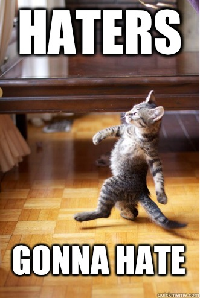

# Getting started

## Recap

- Any questions from last time?

- Any questions from the reading?

## Haters gonna hate -- study confirms {.smaller}

<div class="columns-2">
Read: http://slate.me/1dr5XPE

1. What are the cases, i.e. observations?
2. What is (are) the response variable(s) in this study?
3. What is (are) the explanatory variable(s) in this study?
4. Does the study employ random sampling? How about random assignment?
5. Is this an observational study or an experiment? Explain your reasoning.
6. Can we establish a causal link between the explanatory and response variables?
7. Can the results of the study be generalized to the population at large?


</div>

# Coding style

## Style guide

*"Good coding style is like correct punctuation: you can manage without it, butitsuremakesthingseasiertoread."*
- Hadley Wickham

- Style guide for this course is based on the Tidyverse style guide: http://style.tidyverse.org/

- There's more to it than what we'll cover today, but we'll mention more as we introduce more functionality, and do a recap later in the semester

## File names and code chunk labels

- Do not use spaces in file names, use `-` or `_` to separate words
- Use all lowercase letters

```{r eval = FALSE}
# Good
ucb-admit.csv

# Bad
UCB Admit.csv
```

## Object names

- Use `_` to separate words in object names
- Use informative but short object names
- Do not reuse object names within an analysis

```{r eval = FALSE}
# Good
acs_employed

# Bad
acs.employed
acs2
acs_subset
acs_subsetted_for_males
```

## Spacing

- Put a space before and after all infix operators (=, +, -, <-, etc.), and when naming arguments in function calls. 
- Always put a space after a comma, and never before (just like in regular English).

```{r eval = FALSE}
# Good
average <- mean(feet / 12 + inches, na.rm = TRUE)

# Bad
average<-mean(feet/12+inches,na.rm=TRUE)
```

## ggplot

- Always end a line with `+`
- Always indent the next line

```{r eval = FALSE}
# Good
ggplot(diamonds, mapping = aes(x = price)) +
  geom_histogram()

# Bad
ggplot(diamonds,mapping=aes(x=price))+geom_histogram()
```

## Long lines

- Limit your code to 80 characters per line. This fits comfortably on a printed page with a reasonably sized font.

- Take advantage of RStudio editor's auto formatting for indentation at line breaks.

## Assignment

- Use `<-` not `=`

```{r eval = FALSE}
# Good
x <- 2

# Bad
x = 2
```

## Quotes

Use `"`, not `'`, for quoting text. The only exception is when the text already contains double quotes and no single quotes.

```{r eval = FALSE}
ggplot(diamonds, mapping = aes(x = price)) +
  geom_histogram() +
  # Good
  labs(title = "`Shine bright like a diamond`",
  # Good
       x = "Diamond prices",
  # Bad
       y = 'Frequency')
```

# Case study: SAT scores and teacher salary

## SAT scores

<div id="question">
What relationship would you expect to see between average SAT scores and average salaries of teachers?
</div>

## Data

Data are from 1997! The dataset is in the `moasicData` package, and we will also make use of `dplyr` and `ggplotot2`.

```{r message=FALSE}
library(mosaicData)
library(ggplot2)
library(dplyr)
```

## Confirmed?

```{r}
ggplot(SAT, mapping = aes(x = salary, y = sat)) +
  geom_point() +
  geom_smooth(method = "lm", se = FALSE)
```

## Percentage of all eligble students taking the SAT

```{r}
SAT <- SAT %>%
  mutate(frac_cat = case_when(
    frac <= 22             ~ "low",
    frac > 22 & frac <= 49 ~ "medium",
    frac > 50              ~ "high"
  ))
```

## Revisit

<div id="question">
Describe the relationship between average SAT scores and average salaries of teachers?
</div>

```{r}
ggplot(SAT, mapping = aes(x = salary, y = sat, color = frac_cat)) +
  geom_point() +
  geom_smooth(method = "lm", se = FALSE)
```

# Case study: Smoking kills?

## Your turn

Let's get started on Mini HW 6: 

- Brief presentation of findings so far at the end of class
- Finish up write up by next class
