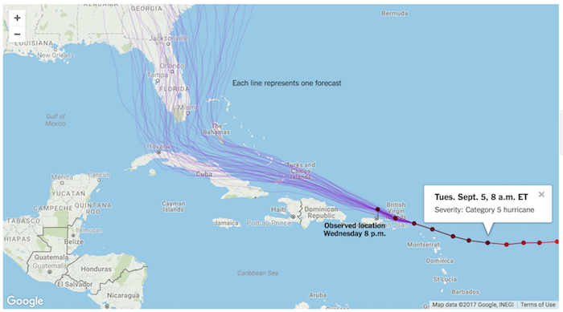
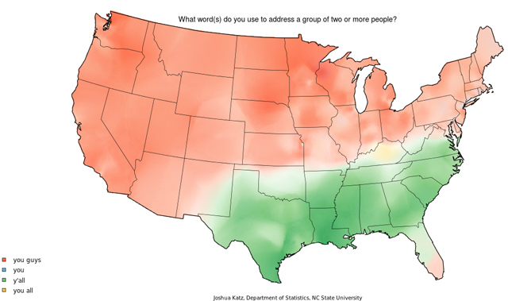

```{r echo=FALSE, message=FALSE}
library(openintro)
library(ggplot2)
library(gridExtra)
library(dplyr)
```


# Getting started

## Follow up from last time...

- Everyone in sitting with their teams?

- Any questions on material from last time?

- Any questions on homework?

- A few of you still don't have photos on your GitHub profiles

# Reading recap

## `openintro` package

For the following we'll be using the `email` dataset from the `openintro` package:

```{r}
library(openintro)
```


## Shapes of distributions

<div class="question">
How would you describe the shape of this distribution?
</div>

```{r}
ggplot(email, aes(x = num_char)) +
  geom_histogram(binwidth = 5) +
  labs(x = "Number of characters")
```

## Binwidth

<div class="question">
Which of the following seems like a reasonable binwidth?
</div>

```{r echo=FALSE, fig.height = 4.75}
p1 <- ggplot(email, aes(x = num_char)) + geom_histogram(binwidth = 1) + labs(title = "binwidth = 1") + xlim(0, 200) + labs(xlab = "")
p2 <- ggplot(email, aes(x = num_char)) + geom_histogram(binwidth = 5) + labs(title = "binwidth = 5") + xlim(0, 200) + labs(xlab = "")
p3 <- ggplot(email, aes(x = num_char)) + geom_histogram(binwidth = 20) + labs(title = "binwidth = 20") + xlim(0, 200) + labs(x = "Number of characters")
grid.arrange(p1, p2, p3, ncol = 1)
```

## Measures of center

<div class="question">
**TEAM:** There are 3921 emails in this dataset. What is roughly the median number of line breaks in emails in this dataset? Is the average (mean) expected to be higher or lower than that value, and why?
</div>

```{r echo=FALSE}
ggplot(email, aes(x = line_breaks)) +
  geom_histogram(binwidth = 250, boundary = 0, color = "lightgray") +
  labs(x = "Number of line breaks")
```

## Boxplots {.smaller}

<div class="question">
How do the distributions of number of characters vary between emails that contain no numbers, small numbers, or big numbers?
</div>

```{r fig.height = 3}
ggplot(data = email, aes(x = number, y = num_char)) +
  geom_boxplot() +
  labs(x = "No number, small number (<1 million), or big number",
       y = "Number of characters")
```

## Segmented bar plots {.smaller}

<div class="question">
Which of the following is a more useful representation for evaluating whether emails with subjects that start with "re:" are more likely to be categorized as spam or not?
</div>

```{r echo=FALSE}
email <- email %>%
  mutate(
    spam = ifelse(spam == 0, "not spam", "spam"),
    re_subj = ifelse(re_subj == 0, "no", "yes")
  )
```


```{r echo=FALSE, fig.width = 8}
p1 <- ggplot(email, aes(x = spam, fill = re_subj)) +
  geom_bar(position = "fill") +
  labs(x = "", fill = "re:", title = 'position: "fill"')
p2 <- ggplot(email, aes(x = spam, fill = re_subj)) +
  geom_bar(position = "stack") +
  labs(x = "", fill = "re:", title = 'position: "stack"')
grid.arrange(p1, p2, nrow = 1)
```

## Segmented bar plots - filled

```{r}
ggplot(email, aes(x = spam, fill = re_subj)) +
  geom_bar(position = "fill") +
  labs(x = "", fill = "re:", title = 'position: "fill"')
```


## Segmented bar plots - stacked

```{r}
ggplot(email, aes(x = spam, fill = re_subj)) +
  geom_bar(position = "fill") +
  labs(x = "", fill = "re:", title = 'position: "fill"')
```

# Customizing your plots

## Starting point {.smaller}

```{r}
starwars <- starwars %>%
  filter(mass < 500)

ggplot(data = starwars, aes(x = height, y = mass, color = gender)) +
  geom_point()
```

## Add title  {.smaller}

```{r}
ggplot(data = starwars, aes(x = height, y = mass, color = gender)) +
  geom_point() +
  labs(title = "Mass vs. height of Star Wars characters")
```

## Add x and y labels  {.smaller}

```{r}
ggplot(data = starwars, aes(x = height, y = mass, color = gender)) +
  geom_point() +
  labs(title = "Mass vs. height of Star Wars characters",
       x = "Height (in cm)", y = "Mass (in kg)")
```

## Change legend label  {.smaller}

```{r}
ggplot(data = starwars, aes(x = height, y = mass, color = gender)) +
  geom_point() +
  labs(title = "Mass vs. height of Star Wars characters",
       x = "Height (in cm)", y = "Mass (in kg)", color = "Gender")
```

## Change zooming {.smaller}

```{r}
ggplot(data = starwars, aes(x = height, y = mass, color = gender)) +
  geom_point() +
  labs(title = "Mass vs. height of Star Wars characters",
       x = "Height (in cm)", y = "Mass (in kg)", color = "Gender") +
  xlim(c(100, 200)) + 
  ylim(c(40, 120))
```

## Change transparency {.smaller}

```{r}
ggplot(data = starwars, aes(x = height, y = mass, color = gender)) +
  geom_point(alpha = 0.3) +
  labs(title = "Mass vs. height of Star Wars characters",
       x = "Height (in cm)", y = "Mass (in kg)", fill = "Gender")
```

## Change theme  {.smaller}

```{r}
ggplot(data = starwars, aes(x = height, y = mass, color = gender)) +
  geom_point() +
  labs(title = "Mass vs. height of Star Wars characters",
       x = "Height (in cm)", y = "Mass (in kg)", color = "Gender") +
  theme_dark()
```

## Change theme  {.smaller}

```{r}
# install.packages("ggthemes")
library(ggthemes)

ggplot(data = starwars, aes(x = height, y = mass, color = gender)) +
  geom_point() +
  labs(title = "Mass vs. height of Star Wars characters",
       x = "Height (in cm)", y = "Mass (in kg)", color = "Gender") +
  theme_fivethirtyeight()
```

## Further customization

- It is possible to do a lot more customization to your plots
- See http://ggplot2.tidyverse.org/ for help on using the ggplot2 package
    + You can find a list of all ggplot2 functions in the Reference tab of the package homepage
- You'll find that sometimes customization is valuable, and sometimes the defaults work well and while customization might be doable (technically) it might not be necessary

# Visualizing spatial data

## Spatial data

- Also known as geospatial data or geographic information it is the data or information that identifies the geographic location of features and boundaries on Earth, such as natural or constructed features, oceans, and more.

- Spatial data is usually stored as coordinates and topology, and is data that can be mapped.

## Hurricane Irma

<div class="question">
**TEAM:** Sketch what a tidy data frame that could be used to generate the following map depicting where Hurricane Irma is headed would look like, i.e. what's in the rows, and what's in the columns? (See original interactive map at https://nyti.ms/2x7nKLD.)
</div>



## Sweetened carbonated beverage

<div class="question">
Describe the spatial distribution of preferred sweetened carbonated beverage drink.
</div>


## Hey y'all!

<div class="question">
What is missing in this visualization?
</div>



# Wrapping up

## Assignment(s)

- Will post instructions on caching password for GitHub, follow along, ask on Slack if you get stuck, come to OH on Monday and we can do it together

- Mini Homework 04

