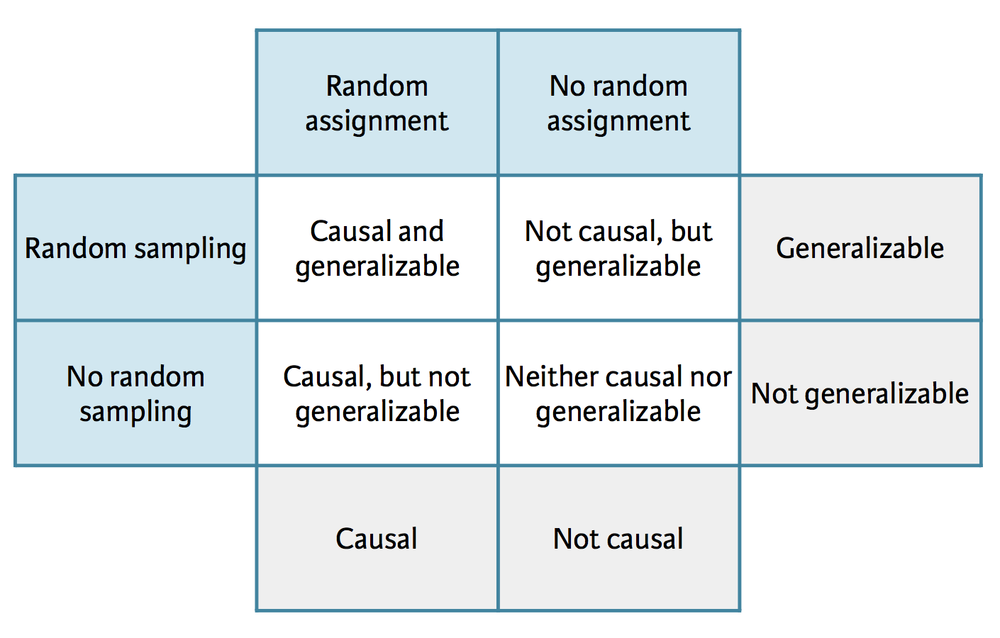
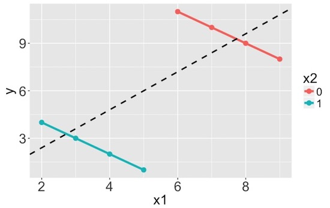

```{r echo=FALSE, message=FALSE}
library(tidyverse)
```


# Getting started

## Announcements

- MT1 and MT2 dates pushed back by one class period:
    - MT1 - assigned Thu Sep 28 after class, due Tue Oct 3 by class
    - MT2 - assigned Thu Nov 2 after class, due Tue Nov 7 by class
- My office hours next Monday (Sep 25) moved to 12-2pm

## Slack {.smaller}

- Does everyone have the app downloaded? If not, please do. You might also consider the phone app too.
- Have you joined the announcements channel? Please make sure you're getting all the announcements.
- Team channels -- for team specific questions, not for generic conceptual/R/GitHub questions, ask these on relevant channels so that others can benefit from the answers as well
- Code formatting -- good habit to get into, makes it easier to read your code and provide help
- Asking for help, especially on R related matters -- always provide code and (if any) error. Copy-paste instead of screenshot so that others can easily re-run your code.
- Ask **and answer** questions, even if you're not sure of your answer, even if your answer is partial

## Team meetings

Now that you've had a chance to work on a substantial assignment as a team, it's time to look back, evaluate what worked and what didn't. Pick a 20min period within these that you can attend as a team, let me know at the end of class.

- Tuesday (today) - 3:30-5:30pm
- Wednesday - 10:30am-noon + 1-3:30pm
- Thursday - noon-3:30pm
- Friday - 2-5pm

# Revisit the vis

```{r echo=FALSE, message=FALSE}
fishing <- read_csv("data/Fishing_industry_by_country.csv")
```


## d-testable - Data prep {.smaller}

```{r message=FALSE}
fishing <- read_csv("data/Fishing_industry_by_country.csv")

fishing <- fishing %>%
  # Remove Hong Kong and Other as those don't show up on the map
  filter(!(Country %in% c("Hong Kong", "Other"))) %>%
  # Rename some of the countries so they match how they are spelled on the world map
  mutate(
    Country = case_when(
      Country == "Congo, Democratic Republic of the" ~ "Democratic Republic of the Congo",
      Country == "People's Republic of China" ~ "China",
      Country == "Taiwan (Republic of China)" ~ "Taiwan",
      Country == "Russian Federation" ~ "Russia",
    TRUE ~ Country
    ),
    perc_capture = (Capture / (Capture + Aquaculture)) * 100 # For percentages
    )
```

## d-testable - Plot {.smaller}

```{r message=FALSE}
country_map <- map_data("world")
ggplot(fishing, aes(map_id = Country)) +
  geom_map(data = country_map, map = country_map, aes(map_id = region), 
           fill = "white", color = "grey", lwd = 0.1) +
  geom_map(aes(fill = perc_capture), map = country_map, color = "black", lwd = 0.1) +
  expand_limits(x = country_map$long, y = country_map$lat)+
  labs(x = "Latitude", y = "Longitude", title = "Percentage of Capture by Country")+
  labs(fill = "Percentage\nof Capture") + # Line break in title
  scale_fill_gradient(low = "pink", high = "maroon")
```

## graphs-r-us - Plot code {.smaller}

```{r echo=FALSE}
year <- c(1975, 1989, 1993, 1995, 1999, 2001, 2003, 2005, 2007, 2009, 2011)
FTTF <- c(29, 27.6, 25, 24.8, 21.8, 20.3, 19.3, 17.8, 17.2, 16.8, 16.7)
FTTTF <- c(16.1, 11.4, 10.2, 9.6, 8.9, 9.2, 8.8, 8.2, 8, 7.6, 7.4)
FTNTTF <- c(10.3, 14.1, 13.6, 13.6, 15.2, 15.5, 15, 14.8, 14.9, 15.1, 15.4)
PTF <- c(24, 30.4, 33.1, 33.2, 35.5, 36, 37, 39.3, 40.5, 41.1, 41.3)
GSE <- c(20.5, 16.5, 18.1, 18.8, 18.7, 19, 20, 19.9, 19.5, 19.4, 19.3)
```

```{r eval=FALSE}
ggplot(mapping = aes(x = year)) +
  geom_point(aes(y = FTTF)) + geom_line(aes(y = FTTF)) +
  geom_point(aes(y = FTTTF)) + geom_line(aes(y = FTTTF)) +
  geom_point(aes(y = FTNTTF)) + geom_line(aes(y = FTNTTF)) +
  geom_point(aes(y = PTF), color = "red") + geom_line(aes(y = PTF), color = "red") +
  geom_point(aes(y = GSE)) + geom_line(aes(y = GSE)) +
  labs(x = "Year", y = "Percent of Total Instructional Staff", 
       title = "Change in Percentage of Part-Time Faculty over Time, 1975-2011") +
  xlim(c(1970, 2020)) +
  annotate("text", x = 2012, y = c(41, 20, 17, 14, 8), 
           label = c("Part-time\nfaculty", "Grad students", "Tenured faculty", 
                     "Non-tenure-\ntrack faculty", "Tenure-track\nfaculty"),
           color = c("red", rep("black", 4)), hjust = 0)
```

## graphs-r-us - Plot {.smaller}

```{r echo=FALSE, fig.height = 5, fig.width=8}
ggplot(mapping = aes(x = year)) +
  geom_point(aes(y = FTTF)) + geom_line(aes(y = FTTF)) +
  geom_point(aes(y = FTTTF)) + geom_line(aes(y = FTTTF)) +
  geom_point(aes(y = FTNTTF)) + geom_line(aes(y = FTNTTF)) +
  geom_point(aes(y = PTF), color = "red") + geom_line(aes(y = PTF), color = "red") +
  geom_point(aes(y = GSE)) + geom_line(aes(y = GSE)) +
  labs(x = "Year", y = "Percent of Total Instructional Staff", 
       title = "Change in Percentage of Part-Time Faculty over Time, 1975-2011") +
  xlim(c(1970, 2020)) +
  annotate("text", x = 2012, y = c(41, 20, 17, 14, 8), 
           label = c("Part-time\nfaculty", "Grad students", "Tenured faculty", 
                     "Non-tenure-\ntrack faculty", "Tenure-track\nfaculty"),
           color = c("red", rep("black", 4)), hjust = 0)
```


## tibble

# Confounding

## Scientific studies

- Observational
    - Collect data in a way that does not interfere with how the data arise ("observe")
    - Only establish an association

- Experimental
    - Randomly assign subjects to treatments
    - Establish causal connections

<div class="question">
Design a study comparing average energy levels of people who do and do not exercise -- both as an observational study and as an experiment.
</div>

## Study: Breakfast cereal keeps girls slim {.smaller}

Girls who ate breakfast of any type had a lower average body mass index, a common obesity gauge, than those who said they didn't. The index was even lower for girls who said they ate cereal for breakfast, according to findings of the study conducted by the Maryland Medical Research Institute with funding from the National Institutes of Health (NIH) and cereal-maker General Mills.
 
[...]
 
The results were gleaned from a larger NIH survey of 2,379 girls in California, Ohio, and Maryland who were tracked between the ages of 9 and 19.
 
[...]
 
As part of the survey, the girls were asked once a year what they had eaten during the previous three days.
 
[...]

<div class="question">
What is the explanatory and what is the response variable?
</div>

## 3 possible explanations

1. Eating breakfast causes girls to be slimmer 
2. Being slim causes girls to eat breakfast
3. A third variable is responsible for both -- a **confounding** variable: an extraneous variable that affects both the explanatory and the response variable, and that make it seem like there is a relationship between them

## Correlation != causation {.smaller}


<br><br><br>

Randall Munroe CC BY-NC 2.5 http://xkcd.com/552/

## Studies and conclusions



# Simpson's paradox

## Relationships between variables

- Bivariate relationship: Fitness -> Heart health

- Multivariate relationship: Calories + Age + Fitness -> Heart health

## Simpson's paradox {.smaller}

- Not considering an important variable when studying a relationship can result in what we call a **Simpson's paradox**, which illustrates the effect the omission of an explanatory variable can have on the measure of association between another explanatory variable and a response variable. 

- In other words, the inclusion of a third variable in the analysis can change the apparent relationship between the other two variables. 



## Berkeley admission data

- Study carried out by the graduate Division of the University of California, Berkeley in the early 70’s to evaluate whether there was a sex bias in graduate admissions

- The data come from six departments. For confidentiality we'll call them A-F. 

- We have information on whether the applicant was male or female and whether they were admitted or rejected. 

- First, we will evaluate whether the percentage of males admitted is indeed higher than females, overall. Next, we will calculate the same percentage for each department.

## Data frame

```{r message=FALSE}
ucb_admit <- read_csv("data/ucb_admit.csv")
ucb_admit
```
## Glimpse at the data

```{r message=FALSE}
glimpse(ucb_admit)
```

## Conditional probability

$P(A | B)$: Probability of event A given event B


## Overall gender distribution - tabular, counts {.smaller}

<div class="question">
What can you say about the overall gender distribution? Hint: Calculate the following probabilities: $P(Admit | Male)$ and $P(Admit | Female)$.
</div>

```{r echo=FALSE}
ucb_admit %>%
  count(Gender, Admit) %>%
  spread(Admit, n) 
```

## Overall gender distribution - tabular, proportions {.smaller}

<div class="question">
What type of visualization would be appropriate for representing these data?
</div>

```{r echo=FALSE}
ucb_admit %>%
  count(Gender, Admit) %>%
  spread(Admit, n) %>%
  mutate(Perc_Admit = round(Admitted / (Admitted + Rejected), 2))
```

## Overall gender distribution - visual {.smaller}

```{r}
ggplot(ucb_admit, mapping = aes(x = Gender, fill = Admit)) +
  geom_bar(position = "fill")
```

## Gender distribution, by department - tabular, counts {.smaller}

<div class="question">
What can you say about the by department gender distribution?
</div>

```{r echo=FALSE}
ucb_admit %>%
  count(Dept, Gender, Admit) %>%
  spread(Admit, n)
```

## Gender distribution, by department - tabular, proportions {.smaller}

<div class="question">
What type of visualization would be appropriate for representing these data?
</div>

```{r echo=FALSE}
ucb_admit %>%
  count(Dept, Gender, Admit) %>%
  spread(Admit, n) %>%
  mutate(Perc_Admit = round(Admitted / (Admitted + Rejected), 2))
```

## Gender distribution, by department - visual {.smaller}

```{r fig.width=8, fig.height=3}
ggplot(ucb_admit, mapping = aes(x = Gender, fill = Admit)) +
  geom_bar(position = "fill") +
  facet_grid(. ~ Dept) +
  labs(x = "Gender", y = "", fill = "Admission status")
```
