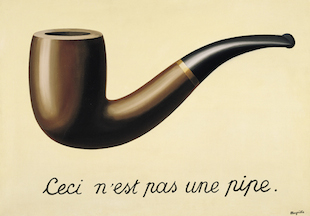
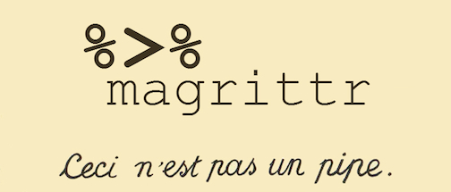

```{r load-packages, message=FALSE, echo=FALSE}
library(gapminder)
library(tidyverse)
library(mosaicData)
library(openintro)
library(emo)
```


# Getting started

## Recap

- Any questions from last time?

- Any questions from the reading?

## Midterm {.smaller}

- Assigned on Thursday Sep 28 at 12:30pm, due Tuesday Oct 3 at 10:05am

- Ask questions via direct message to Kyle and/or I, do not post on other public channels

- Individual assessment:

This exam is open book, open internet, closed other people. You 
may use any online or book based resource you would like, but you 
should include citations for any code that you use (directly or 
indirectly). You may not consult with anyone else for this exam 
other than the professor and the TA. You cannot ask direct questions
on the internet, or consult with each other, not even for hypothetical
questions.

- Duke Community Standard:

Duke University is a community dedicated to scholarship, leadership, and service and to the principles of honesty, fairness, respect, and accountability. Citizens of this community commit to reflect upon and uphold these principles in all academic and non-academic endeavors, and to protect and promote a culture of integrity. Cheating on exams or plagiarism on homework assignments, lying about an illness or absence and other forms of academic dishonesty are a breach of trust with classmates and faculty, violate the Duke Community Standard, and will not be tolerated. Such incidences will result in a 0 grade for all parties involved. Additionally, there may be penalties to your final class grade along with being reported to the Undergraduate Conduct Board.

# Tidy data

## Tidy data {.smaller}

1. Each variable forms a column.
2. Each observation forms a row.
3. Each type of observational unit forms a table.

<div class="question">
Is each of the following a dataset or a summary table?
</div>

<div class="columns-2">

```{r echo=FALSE}
tbl_df(Whickham)
```

```{r echo=FALSE}
Whickham %>%
  count(age, outcome, smoker) %>%
  spread(outcome, n)
```

</div>

# Pipes

## magrittr {.smaller .build}

<div class="centered">
<div style="margin-top: -50px;">

&nbsp;&nbsp;&nbsp;&nbsp;

</div>
</div>

<div>
You can think about the following sequence of actions - find key, unlock car, start car, drive to school, park.
</div>

<div>
Expressed as a set of nested functions in R pseudocode this would look like:

```{r eval=FALSE}
park(drive(start_car(find("keys")), to="campus"))
```
</div>

<div>
Writing it out using pipes give it a more natural (and easier to read) structure:

```{r eval=FALSE}
find("keys") %>%
  start_car() %>%
  drive(to = "campus") %>%
  park()
```
</div>

## What about other arguments {.smaller .build}

To send results to a function argument other than first one or to use the previous result for multiple arguments, use `.`:

```{r fig.height=2, fig.width = 3.75}
acs12 %>%
  filter(employment == "employed") %>%
  ggplot(mapping = aes(x = hrs_work, y = income)) +
    geom_point()
```

```{r}
acs12 %>%
  filter(employment == "employed") %>%
  lm(income ~ hrs_work, data = .)
```

# Data wrangling

## NC DOT Fatal Crashes in North Carolina {.smaller}

From https://opendurham.nc.gov

```{r load-data}
bike <- read_csv2("https://stat.duke.edu/~mc301/data/nc_bike_crash.csv", 
                  na = c("NA", "", "."))
```

## Variables

View the names of variables via
```{r}
names(bike)
```

and see detailed descriptions at https://stat.duke.edu/~mc301/data/nc_bike_crash.html.

## Viewing your data {.smaller}

- In the Environment, click on the name of the data frame to view
it in the data viewer

- Use the `str` function to compactly display the internal **str**ucture 
of an R object

```{r}
str(bike)
```

## A Grammar of Data Manipulation {.smaller}

**dplyr** is based on the concepts of functions as verbs that manipulate data frames.

Single data frame functions / verbs:

* `filter`: pick rows matching criteria
* `slice`: pick rows using index(es)
* `select`: pick columns by name
* `pull`: grab a column as a vector
* `rename`: rename specific columns
* `arrange`: reorder rows
* `mutate`: add new variables
* `transmute`: create new data frame with variables
* `distinct`: filter for unique rows
* `sample_n` / `sample_frac`: randomly sample rows
* `summarise`: reduce variables to values
* ... (many more)


## **dplyr** rules for functions

1. First argument is *always* a data frame

2. Subsequent arguments say what to do with that data frame

3. *Always*$^*$ return a data frame

4. Don't modify in place

5. Performance via lazy evaluation

## A note on piping and layering

- The `%>%` operator in **dplyr** functions is called the pipe operator. This means you "pipe" the output of the previous line of code as the first input of the next line of code.

- The `+` operator in **ggplot2** functions is used for "layering". This means you create the plot in layers, separated by `+`.

## Filter rows with `filter`

- Select a subset of rows in a data frame.
- Easily filter for many conditions at once.

## `filter` {.smaller}

for crashes in Durham County

```{r}
bike %>%
  filter(County == "Durham")
```

## `filter` {.smaller}

for crashes in Durham County where biker was < 10 yrs old

```{r}
bike %>%
  filter(County == "Durham", Bike_Age < 10)
```

## Commonly used logical operators in R {.smaller}

operator    | definition
------------|--------------------------
`<`         | less than
`<=`        |	less than or equal to
`>`         | greater than
`>=`        |	greater than or equal to
`==`        |	exactly equal to
`!=`        |	not equal to
`x | y`     | `x` OR `y`
`x & y`     | `x` AND `y`

## Commonly used logical operators in R {.smaller}

operator     | definition
-------------|--------------------------
`is.na(x)`   | test if `x` is `NA`
`!is.na(x)`  | test if `x` is not `NA`
`x %in% y`   | test if `x` is in `y`
`!(x %in% y)`| test if `x` is not in `y`
`!x`         | not `x`

## Aside: real data is messy! {.smaller}

<div class="question">
What in the world does a `BikeAge_gr` of `10-Jun` or `15-Nov` mean?
</div>

```{r}
bike %>%
  group_by(BikeAge_Gr) %>%
  summarise(crash_count = n())
```

## Careful data scientists clean up their data first!

- We're going to need to do some text parsing to clean up
these data
    + `10-Jun` should be `6-10`
    + `15-Nov` should be `11-15`
  
- New R package: `stringr`

## Install and load: `stringr`

- Install:
```{r eval=FALSE}
install.packages("stringr") # only have to do this once, in your Console
```

- Load:
```{r}
library(stringr)
```

- Package reference: Most R packages come with a vignette that describe
in detail what each function does and how to use them, they're incredibly
useful resources (in addition to other worked out examples on the web)
http://stringr.tidyverse.org/articles/stringr.html

## Replace with `str_replace` and add new variables with `mutate` {.smaller}

- Remember we want to do the following in the `BikeAge_Gr` variable
    + `10-Jun` should be `6-10`
    + `15-Nov` should be `11-15`
 
```{r}
bike <- bike %>%
  mutate(
    BikeAge_Gr = str_replace(BikeAge_Gr, "10-Jun", "6-10"),
    BikeAge_Gr = str_replace(BikeAge_Gr, "15-Nov", "11-15")
    )
```

- Note that we're overwriting existing data and columns, so be careful!
    + But remember, it's easy to revert if you make a mistake since we didn't
    touch the raw data, we can always reload it and start over

## Check before you move on {.smaller}

Always check your changes and confirm code did what you wanted it to do

```{r}
bike %>%
  group_by(BikeAge_Gr) %>%
  summarise(count = n())
```

## `mutate` to add new variables

<div id="question">
How is the new `alcohol` variable determined?
</div>

```{r eval=FALSE}
bike %>%
  mutate(alcohol = case_when(
    Bike_Alc_D == "No" & Drvr_Alc_D == "No"      ~ "No",
    Bike_Alc_D == "Yes" | Drvr_Alc_D == "Yes"    ~ "Yes",
    Bike_Alc_D == "Missing" & Drvr_Alc_D == "No" ~ "Missing",
    Bike_Alc_D == "No" & Drvr_Alc_D == "Missing" ~ "Missing"
  ))
```

## "Save" when you `mutate`

Most often when you define a new variable with `mutate` you'll also want to save the resulting data frame, often by writing over the original data frame.

```{r eval=FALSE}
bike <- bike %>%
  mutate(alcohol = case_when(
    Bike_Alc_D == "No" & Drvr_Alc_D == "No"      ~ "No",
    Bike_Alc_D == "Yes" | Drvr_Alc_D == "Yes"    ~ "Yes",
    Bike_Alc_D == "Missing" & Drvr_Alc_D == "No" ~ "Missing",
    Bike_Alc_D == "No" & Drvr_Alc_D == "Missing" ~ "Missing"
  ))
```

## `transmute` to create a new dataset {.smaller}

You'll use this much less often than `mutate` but when you need it, you need it.

```{r}
bike %>% 
  transmute(ID = paste(FID, OBJECTID, sep = "-"))
```

## `slice` for certain row numbers {.smaller}

First five
```{r}
bike %>%
  slice(1:5)
```

## `slice` for certain row numbers {.smaller}

Last five
```{r}
last_row <- nrow(bike)
bike %>%
  slice((last_row-4):last_row)
```

## `select` to keep only the variables you mention {.smaller}

```{r}
bike %>%
  select(Crash_Loc, Hit_Run) %>%
  table()
```

## or `select` to exclude variables {.smaller}

```{r}
bike %>%
  select(-OBJECTID)
```

## or `select` a range of variables {.smaller}

```{r}
bike %>%
  select(OBJECTID:Bike_Injur)
```

## `pull` to extract a column as a vector {.smaller}

```{r}
bike %>%
  pull(Location) %>%
  head()
```

```{r}
bike %>%
  select(Location)
```

## The two `pull`s in your lives

<div class="centered">
<div style="margin-top: -50px;">

&nbsp;&nbsp;&nbsp;&nbsp;

</div>
</div>

- Don't get `pull` happy when wrangling data! Only extract out variables if you truly need to, otherwise keep in data frame.

- But always `r emo::ji("arrow_down")` `Pull` before starting your work when collaborating on GitHub.

## `rename` specific columns {.smaller}

Useful for correcting typos, and renaming to make variable names shorter 
and/or more informative

- Original names:
```{r}
names(bike)
```

- Rename `Speed_Limi` to `Speed_Limit`:
```{r}
bike <- bike %>%
  rename(Speed_Limit = Speed_Limi)
```

## Check before you move on {.smaller}

Always check your changes and confirm code did what you wanted it to do

```{r}
names(bike)
```

## `summarise` to reduce variables to values {.smaller}

The values are summarised in a data frame

```{r}
bike %>%
  group_by(BikeAge_Gr) %>%
  summarise(crash_count = n())
```

## and `arrange` to order rows {.smaller}

```{r}
bike %>%
  group_by(BikeAge_Gr) %>%
  summarise(crash_count = n()) %>%
  arrange(desc(crash_count))
```

## `count` to group by then count

```{r}
bike %>%
  count(BikeAge_Gr)
```

<div id="question">
If you wanted to arrange these in ascending order what would you add to the pipe?
</div>

## Select rows with `sample_n` or `sample_frac` {.smaller}

- `sample_n`: randomly sample 5 observations

```{r}
bike_n5 <- bike %>%
  sample_n(5, replace = FALSE)
dim(bike_n5)
```

- `sample_frac`: randomly sample 20% of observations

```{r}
bike_perc20 <-bike %>%
  sample_frac(0.2, replace = FALSE)
dim(bike_perc20)
```

</div>

## `distinct` to filter for unique rows

```{r}
bike %>% 
  select(County, City) %>% 
  distinct() %>% 
  arrange(County, City)
```

