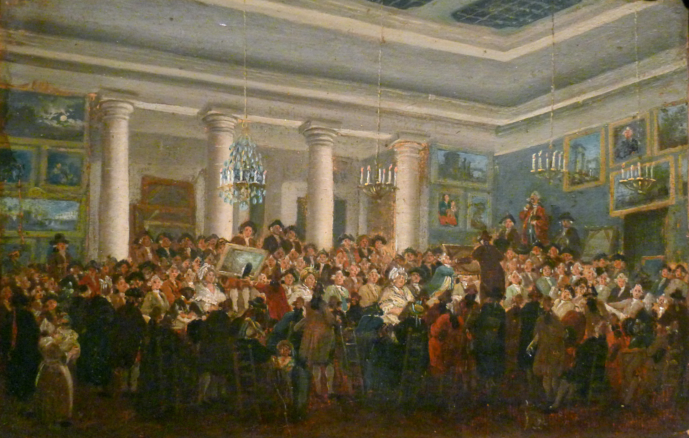
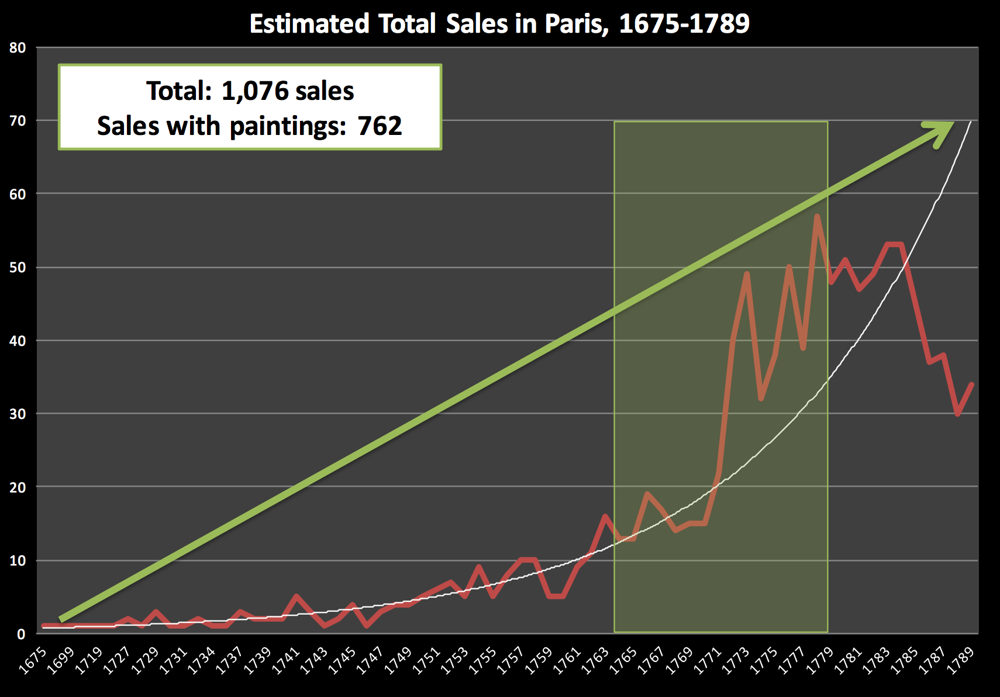
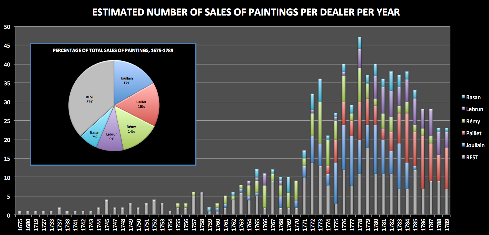
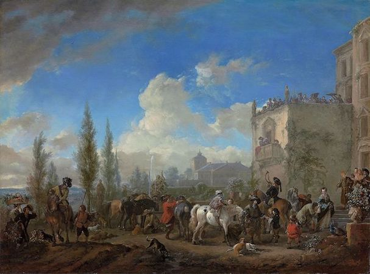
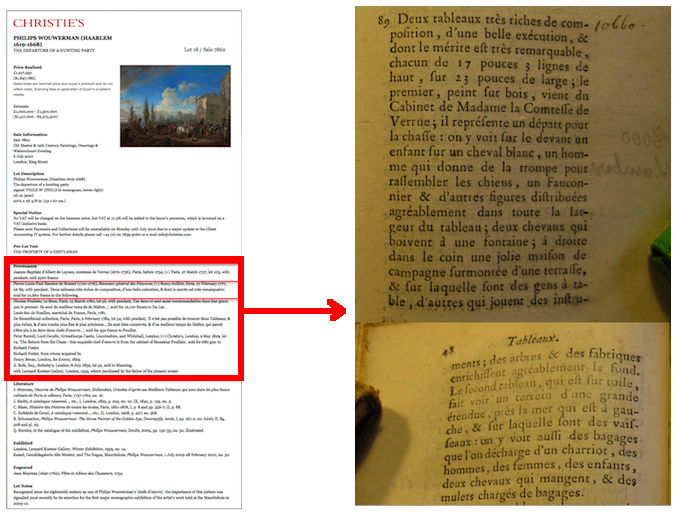
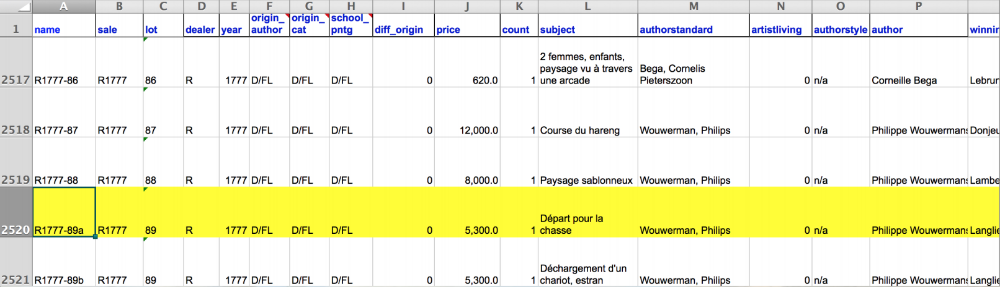

```{r setup, include=FALSE}
options(htmltools.dir.version = FALSE)
```

---
class: center, middle

# Paris Paintings

---

## Paintings in Paris - 1764-1780

- Dataset	compiled by Sandra van Ginhoven and Hilary Coe Cronheim, students (now graduates) of DALMI (Duke Art, Law, and Markets Initiative).
- Source:	printed	catalogues	of	28	auction	sales	in	Paris, 1764-1780
- 3,393	paintings: their prices & descriptive	details	from sales catalogues
- 60 variables	(fields)

---

## Auction sales in 2014

<center>
<iframe width="900" height="417" src="https://www.youtube.com/embed/apaE1Q7r4so" frameborder="0" allowfullscreen data-autoplay></iframe>
</center>

---

## Auction sales in 18th century Paris



Pierre-Antoine de Machy, Public	Sale at	the	Hôtel Bullion, Musée Carnavalet, Paris

Image credit: [Wikimedia Commons](https://upload.wikimedia.org/wikipedia/commons/7/75/P1140608_Carnavalet_Demachy_hotel_Bullion_rwk.jpg)

---

## Estimated total sales over years



---

## Total sales by dealers



---

## Source: Sales catalogues

<center>

<center>

---

## Ex: 	The	Departure	of a Hunting Party

Philip Wouwermans(1619-1668), oil on panel, 52	x	67	cm.	

<center>

<center>

---

## Catalogue, then and now



---

## Catalogue description

> Two	paintings very rich in composition,	of a beautiful execution, and whose	merit is very remarkable, each 17 inches 3 lines high, 23 inches wide the first, painted on wood, comes from the Cabinet of Madame the Countess of Verrue; it represents a departure for the hunt: it shows in the	front a	child on a white horse,	a man who sounds the horn to gather	the	dogs, a	falconer and other figure nicely distributed across	the width of the painting: two horses drinking	from a fountain; on	the	right in the corner	a lovely country house topped by a terrace,	on which people are at the table, others who play instruments;	trees and buildings pleasantly enrich the background.

---

## Dataset: Basic info on paintings



.small[

varible        | description
---------------|-----------------------------------------------------------
name 		       | unique identifier of painting
dealer 		     | dealer initials (4 unique dealers: J, L, P, R)
year           | year of sale
origin_author  | origin of painting based on nationality of artist (A = Austrian, D/FL = Dutch/Flemish, F = French, G = German, I = Italian, S = Spanish, X = Unknown)
origin_cat     | origin of painting based on dealers’ classification in the catalogue (D/FL = Dutch/Flemish, F = French, I = Italian, O = Other, S = Spanish)

]

---

## Dataset: Basic info on paintings (cont.)


.small[
  
varible        | description
---------------|-----------------------------------------------------------
school_pntg    | school of painting (A = Austrian, D/FL = Dutch/Flemish, F = French, G = German, I = Italian, S = Spanish, X = Unknown)
diff_origin    | if origin_author is different than origin_cat (0/1)
price          | price fetched at auction (sales price in livres)
authorstandard | name of artist (standardized)
artistliving   | if artist is living or deceased at time of the sale (1 = yes, 0 = no)
authorstyle    | indicates how, if at all, the authors name is introduced, e.g. school of, copy after, in the manner of etc. or n/a if there is no introduction

]

---

## Dataset: Codebook

Click [here](https://www2.stat.duke.edu/courses/Fall15/sta112.01/data/paris_paintings.html) for the full codebook.

---

## Exploratory questions

- What are some important	features of	the	distribution of	the	prices of paintings sold?
- Describe the	distribution of	schools	of	paintings?
- Are the paintings	sold mostly	by	living	artists?
- How do prices	vary over time  and	by	school	of	painting?
- Is a particular type of buyer more represented  than other?
- Could	we	think of any way to	categorize	the	paintings from high- to	low-end? What could	be some	criteria that	help us	construct his categorization?

---

## Load data

```{r message=FALSE}
library(tidyverse) # ggplot2 + dplyr + readr + and some others
library(stringr)
```

```{r echo=FALSE,message=FALSE}
pp <- read_csv("data/paris_paintings.csv", na = c("n/a", "", "NA"))
```

```{r eval=FALSE,message=FALSE}
pp <- read_csv("data/paris_paintings.csv", na = c("n/a", "", "NA"))
```


---
class: center, middle

# Recoding variables

---

## Shapes of paintings

```{r}
pp %>%
  group_by(Shape) %>%
  summarise(count = n()) %>%
  arrange()
```

---

## Recode scheme

| original   | new         | change?     |
|:-----------|:------------|:------------|
| `miniature`| `miniature` | no          |
|   `octagon`| `octagon`   | no          |
|   `octogon`| `octagon`   | yes         |
|      `oval`| `oval`      | no          |
|     `ovale`| `oval`      | yes         |
|  `squ_rect`| `squ_rect`  | no          |
|     `ronde`| `round`     | yes         |
|     `round`| `round`     | no          |

---

## Recoding shape of painting

Create new variable `shape_recode`:
```{r}
pp <- pp %>%
  mutate(shape_recode = case_when(
    Shape == "ovale"   ~ "oval",
    Shape == "ronde"   ~ "round",
    Shape == "octogon" ~ "octagon",
    # otherwise leave as original Shape
    TRUE               ~ Shape 
  ))
```

---

## Check before you move on!

```{r}
pp %>%
  count(shape_recode, Shape) %>%
  arrange(shape_recode)
```

---

## Check before you move on!

```{r}
pp %>%
  count(shape_recode)
```

---

## Converting  numerical to categorical

- If `nfigures` == 0 $\rightarrow$ `fig_mention` = `no figures`
- If `nfigures` >= 1 $\rightarrow$ `fig_mention` = `some figures`

```{r}
pp <- pp %>%
  mutate(fig_mention = ifelse(nfigures == 0, 
                              "no figures", 
                              "some figures"))
```

---

## Check before you move on!

```{r}
pp %>%
  count(fig_mention, nfigures)
```
  
---

## More than one way to...

<div class="question">
What other function could we use for this? How would you do this using that function?
</div>

```{r eval=FALSE}
pp <- pp %>%
  mutate(fig_mention = ifelse(nfigures == 0, 
                              "no figures", 
                              "some figures"))
```
  
---

## Recoding, kicked up a notch...

Let's tackle the `mat` variable:

```{r}
pp %>% 
  count(mat)
```

---

## Recoding scheme

.small[

mat | explanation           | new categories  | mat  | explanation           | new categories
----|:----------------------|:----------------|:-----|:----------------------|:---------------
`a` | silver                | `metal`         | `h`  | oil technique         | uncertain
`al`| alabaster             | `stone`         | `m`  | marble                | stone
`ar`| slate                 | `stone`         | `mi` | miniature technique   | uncertain
`b` | wood                  | `wood`          | `o`  | other                 | other
`bc`| wood and copper       | `metal`         | `p`  | paper                 | paper
`br`| bronze frames         | `uncertain`     | `pa` | pastel                | uncertain    
`bt`| canvas on wood        | `canvas`        | `t`  | canvas                | canvas      
`c` | copper                | `metal`         | `ta` | canvas?               | uncertain 
`ca`| cardboard             | `paper`         | `v`  | glass                 | other   
`co`| cloth                 | `canvas`        | `g`  | grissaille technique  | uncertain  
`e` | wax                   | `other`         |  

]

---

## Making use of the `%in%` operator

Create new variable `mat_recode`:
```{r}
pp <- pp %>%
  mutate(mat_recode = case_when(
    mat %in% c("a", "bc", "c")  ~ "metal",
    mat %in% c("al", "ar", "m") ~ "stone",
    mat %in% c("al", "ar", "m") ~ "stone",
    mat %in% c("co", "bt", "t") ~ "canvas",
    mat %in% c("p", "ca")       ~ "paper",
    mat == "b"                  ~ "wood",
    mat %in% c("o", "e", "v")   ~ "other",
    TRUE                        ~ "uncertain"
  ))
```

---

## Check before you move on!

```{r}
pp %>%
  count(mat_recode) %>%
  arrange(desc(n))
```

---
class: center, middle

# Transformations

---

## Price vs. surface

<div class="question">
Describe the relationship between price and width of painting.
</div>

```{r fig.width=7,fig.height=4.5}
ggplot(data = pp, aes(x = Width_in, y = price)) +
  geom_point(alpha = 0.5) +
  labs(title = "Price vs. width")
```

---

## Let's focus on small-ish paintings

```{r}
pp_wt_lt_100 <- pp %>% 
  filter(Width_in < 100)
```

---

## Price of small-ish paintings

```{r fig.width=7,fig.height=4.5}
ggplot(data = pp_wt_lt_100, aes(x = price)) +
  geom_histogram(binwidth = 500) +
  labs(title = "Small-ish paintings, price")
```

---

## Log(price) of small-ish paintings

```{r fig.width=7,fig.height=4.5}
ggplot(data = pp_wt_lt_100, aes(x = log(price))) +
  geom_histogram(binwidth = 0.5) +
  labs(title = "Small-ish paintings, log(price)")
```

---

## Log(price) paintings vs. width

```{r fig.width=7,fig.height=4.5}
ggplot(data = pp_wt_lt_100, aes(x = Width_in, y = log(price))) +
  geom_point(alpha = 0.5) +
  labs(title = "Small-ish paintings, log(price) vs. width")
```
