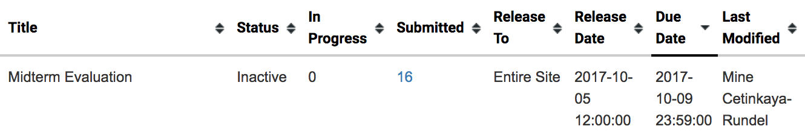

```{r setup, include=FALSE}
options(htmltools.dir.version = FALSE)
blue = "#425460"
library(emo)
library(tidyverse)
```

class: center, middle

# Getting started

---

## Getting started

- Any questions from last time?

- Change in grading scheme: 15% for mini hw + in class exercises

- Stickers?

- Come in costume on 10/31: come as your favourite data science / stats / R thing
  - Participation optional, but strongly encouraged, I'll bring the candy `r emo::ji("wink")`

- Review of midterm evals
  - Unfortunately response rate was not 100% `r emo::ji("disappointed")`
  


- Linear models with single and multiple predictors

---

## Midterm feedback

**What is your opinion of this class so far?**

- Very positive overall, for many it's their favourite class! -- `r emo::ji("grin")`

- More time on stats -- hopefully today will be a good example

- Arbitrary grading -- it's really not, please review issues, if still unclear, please ask

---

## Midterm feedback

**What do you like best about this class so far?**

- Visualization

- Coding

- Availability of help

---

## Midterm feedback

**Of the topics we have covered so far, which (if any) are you confused about?**

- Changes to data frame carrying through R Markdown document

- Vectors and arrays -- don't worry about these too much, we'll mostly spend time in data frame / tibble land

---

## Midterm feedback

**The pace of the class is**

```{r echo=FALSE, fig.height=3, fig.width=7}
df <- data_frame(pace = c(rep("About right", 13), rep("Too fast", 1)))
ggplot(df, aes(x = pace)) +
  geom_bar(position = "stack") +
  coord_flip()
```

---

## Midterm feedback

**On average, how many hours do you spend on assignments?**

- Mostly between 1-3 hours

- Midterm took much longer than expected -- will keep in mind for Midterm 2

---

## Midterm feedback

**Do you have any comments about the TA?**

Some of you have not interacted much with Kyle `r emo::ji("scream")` `r emo::ji("disappointed")`, it's time to visit office hours!

---

## Midterm feedback

**Do you have any other comments or suggestions about specific components of this course?**

- More hands on case studies -- `r emo::ji("ok_hand")`

- Assign longer assignments on Thursdays -- `r emo::ji("+1")`

- Guidelines on what full answers look like -- this is hard to accomplish without providing a template, but office hours are great way for talking through answers and getting feedback as you work on the homework

---

## Midterm feedback

**Do you think data science is worth learning?**

100% of respondents said `r emo::ji("+1")`! -- `r emo::ji("fist_left")`

---

class: center, middle

# Terminology

---

## Data collection

- Ultimate goal: make inferences about populations

--

- Caveat: populations are difficult or impossible to access

--

- Solution: use a sample from that population, and use **sample statistics** to make inferences about the unknown **population parameters**

--

- The better (more **representative**) sample we have, the more reliable our 
estimates and more accurate our inferences will be

--

<div class="question">
Suppose we want to know how many offspring female lemurs have, on average. It’s not feasible to obtain offspring data from on all female lemurs, so we use data from the Duke Lemur Center. We use the sample mean from these data as an estimate for the unknown population mean. Can you see any limitations to using data from the Duke Lemur Center to make inferences about all lemurs?
</div>

---

## Sampling is natural

.pull-left[
- When you taste a spoonful of soup and decide the spoonful you tasted isn't salty 
enough, that's **exploratory analysis**

- If you generalize and conclude that your entire soup needs salt, that's **inference**

- For your inference to be valid, the spoonful you tasted (the sample) needs to be 
**representative** of the entire pot (the population)
]

.pull-right[

]

---

class: center, middle

# Formalizing the linear model

---

## The linear model with a single predictor

- We're interested in the $\beta_0$ (population parameter for the intercept)
and the $\beta_1$ (population parameter for the slope) in the 
following model:

$$ \hat{y} = \beta_0 + \beta_1~x $$

--

- Tough luck, you can't have them...

--

- So we use the sample statistics to estimate them:

$$ \hat{y} = b_0 + b_1~x $$

---

## The linear model with multiple predictors

- Population model:

$$ \hat{y} = \beta_0 + \beta_1~x_1 + \beta_2~x_2 + \cdots + \beta_k~x_k $$

--

- Sample model that we use to estimate the population model:
  
$$ \hat{y} = b_0 + b_1~x_1 + b_2~x_2 + \cdots + b_k~x_k $$

---

## Uncertainty around estimates

- Any estimate comes with some uncertainty around it.

- Later in the course we'll discuss how to estimate the uncertainty around
an estimate, such as the slope, and the conditions required for quantifying
uncertainty around estimates using various methods.

```{r echo=FALSE, fig.width = 7, fig.height = 4}
set.seed(12345)
df <- data_frame(x = rnorm(100, 100, 10), y = 3*x + 50 + rnorm(100, 10, 40))
ggplot(df, aes(x = x, y = y)) +
  geom_point() +
  geom_smooth(method = "lm", color = blue)
```

---

class: center, middle

# The linear model with a single predictor

---

## Data: Paris Paintings

```{r message=FALSE, eval=FALSE}
library(tidyverse) # ggplot2 + dplyr + readr + and some others
```

```{r message=FALSE}
pp <- read_csv("data/paris_paintings.csv", na = c("n/a", "", "NA"))
```

```{r, fig.height=4, fig.width=7, echo=FALSE}
ggplot(data = pp, aes(x = price)) +
  geom_histogram(binwidth = 1000) +
  labs(title = "Prices of paintings")
```

---

## Price vs. width

<div class="question">
Describe the relationship between price and width of painting.
</div>

```{r fig.width=7,fig.height=4}
ggplot(data = pp, aes(x = Width_in, y = price)) +
  geom_point(alpha = 0.5)
```

---

## Let's focus on paintings with `Width_in < 100`

```{r fig.width=7,fig.height=4}
pp_wt_lt_100 <- pp %>% 
  filter(Width_in < 100)
```

---

## Price vs. width

<div class="question">
Which plot shows a more linear relationship?
</div>

.small[
  
.pull-left[
```{r fig.width=5, fig.height=4, message=FALSE}
ggplot(data = pp_wt_lt_100, 
       mapping = aes(x = Width_in, y = price)) +
  geom_point(alpha = 0.5)
```
]

.pull-right[
```{r fig.width=5, fig.height=4, message=FALSE}
ggplot(data = pp_wt_lt_100, 
       mapping = aes(x = Width_in, y = log(price))) +
  geom_point(alpha = 0.5)
```
]

]

---

## Transforming the data

- We saw that `price` has a right-skewed distribution, and the relationship between price and width of painting is non-linear.

--

- In these situations a transformation applied to the response variable may be useful.

--

- In order to decide which transformation to use, we should examine the distribution of the response variable.

--

- The extremely right skewed distribution suggests that a log transformation may 
be useful.
    - log = natural log, $ln$
    - Default base of the `log` function in R is the natural log: <br>
    `log(x, base = exp(1))`
    
---

## Logged price vs. width

<div class="question">
How do we interpret the slope of this model?
</div>

```{r fig.width=7, fig.height=4}
ggplot(data = pp_wt_lt_100, mapping = aes(x = Width_in, y = log(price))) +
  geom_point(alpha = 0.5) +
  geom_smooth(method = "lm")
```

---

## Interpreting models with log transformation

```{r}
(m_lprice_wt <- lm(log(price) ~ Width_in, data = pp_wt_lt_100))
```

---

## Linear model with log transformation

$$ \widehat{log(price)} = 4.67 + 0.02 Width $$

--

- For each additional inch the painting is wider, the log price of the
painting is expected to be higher, on average, by 0.02 livres.

--

- which is not a very useful statement...

---

## Working with logs

- Subtraction and logs: $log(a) − log(b) = log(a / b)$

--

- Natural logarithm: $e^{log(x)} = x$

--

- We can use these identities to "undo" the log transformation

---

## Interpreting models with log transformation

The slope coefficient for the log transformed model is 0.02, meaning the log 
price difference between paintings whose widths are one inch apart is predicted 
to be 0.02 log livres.

--

$$ log(\text{price for width x+1}) - log(\text{price for width x}) = 0.02 $$

--

$$ log\left(\frac{\text{price for width x+1}}{\text{price for width x}}\right) = 0.02 $$

--

$$ e^{log\left(\frac{\text{price for width x+1}}{\text{price for width x}}\right)} = e^{0.02} $$

--

$$ \frac{\text{price for width x+1}}{\text{price for width x}} \approx 1.02 $$

--

For each additional inch the painting is wider, the price of the
painting is expected to be higher, on average, by a factor of 1.02.

---

## Shortcuts in R

```{r}
m_lprice_wt$coefficients
exp(m_lprice_wt$coefficients)
```

--

<br>

But if I were reporting these values...

--

```{r}
round(exp(m_lprice_wt$coefficients), 2)
```

---

## Recap

- Non-constant variance is one of the most common model violations, however it 
is usually fixable by transforming the response (y) variable.

--

- The most common transformation when the response variable is right skewed is 
the log transform: $log(y)$, especially useful when the response variable is 
(extremely) right skewed.

--

- This transformation is also useful for variance stabilization.

--

- When using a log transformation on the response variable the interpretation of 
the slope changes: <br>

*"For each unit increase in x, y is expected on average to be higher/lower <br> by a factor of $e^{b_1}$."*

--

- Another useful transformation is the square root: $\sqrt{y}$, especially 
useful when the response variable is counts.

--

- These transformations may also be useful when the relationship is non-linear, 
but in those cases a polynomial regression may also be needed (this is beyond 
the scope of this course, but you’re welcomed to try it for your final project, 
and I’d be happy to provide further guidance).

---

## Aside: when $y = 0$

In some cases the value of the response variable might be 0, and

```{r}
log(0)
```

--

The trick is to add a very small number to the value of the response variable for these cases so that the `log` function can still be applied:

```{r}
log(0 + 0.00001)
```

---

class: center, middle

# The linear model with multiple predictors

---

## Price, surface area, and living artist

<div class="question">
What is the typical surface area for paintings?
</div>

```{r fig.height=4, echo=FALSE,warning=FALSE}
ggplot(data = pp, 
       mapping = aes(y = log(price), x = Surface, color = factor(artistliving))) +
  geom_point(alpha = 0.3) +
  labs(color = "Living artist")
```

--

Less than 1000 square inches (which is roughly a painting that is 31in x 31in). There are very few paintings that have surface area above 5000 square inches.

---

## Price, surface area, and living artist

For simplicity let's focus on the paintings with `Surface < 5000`:

```{r fig.height=4, echo=FALSE,warning=FALSE}
pp_Surf_lt_5000 <- pp %>%
  filter(Surface < 5000)

ggplot(data = pp_Surf_lt_5000, 
       mapping = aes(y = log(price), x = Surface, color = factor(artistliving))) +
  geom_point(alpha = 0.3) +
  labs(color = "Living artist")
```

---

## Price vs. surface and living artist

<div class="question">
Does the relationship between surface and logged price vary by whether or not
the artist is living?
</div>

```{r fig.height=3.75}
ggplot(data = pp_Surf_lt_5000,
       mapping = aes(y = log(price), x = Surface, 
                     color = factor(artistliving))) +
  geom_point(alpha = 0.3) +
  geom_smooth(method = "lm", se = FALSE) +
  labs(color = "Living artist")
```

---

## Modeling with main effects 

```{r}
(m_main <- lm(log(price) ~ Surface + factor(artistliving), 
              data = pp_Surf_lt_5000))
```

--

<br>

$$ \widehat{log(price)} = 4.88 + 0.00027~surface + 1.14~artistliving $$

--

- Plug in 0 for `artistliving` to get the linear model for paintings by non-living
artists.

- Plug in 1 for `artistliving` to get the linear model for paintings by living
artists.

---

## Interpretation of main effects

.pull-left[
```{r fig.height=4, echo = FALSE}
ggplot(data = pp_Surf_lt_5000,
       aes(y = log(price), x = Surface, color = factor(artistliving))) +
  geom_point(alpha = 0.3) +
  geom_abline(intercept = 4.88, slope = 0.00027, color = "#F57670", lwd = 1) +
  geom_abline(intercept = 6.02, slope = 0.00027, color = "#1FBEC3", lwd = 1) +
  labs(color = "Living artist")
```
]

.pull-right[
- Non-living artist: 
$\widehat{log(price)} = 4.88 + 0.00027~surface + 1.14 \times 0$
$= 4.88 + 0.00027~surface$

- Living artist: 
$\widehat{log(price)} = 4.88 + 0.00027~surface + 1.14 \times 1$
$= 6.02 + 0.00027~surface$
</div>
]

- Rate of change in price as the surface area of the painting increases does 
not vary between paintings by living and non-living artists (same slope), 

- Paintings by living artists are consistently more expensive than paintings by
non-living artists (different intercept).
