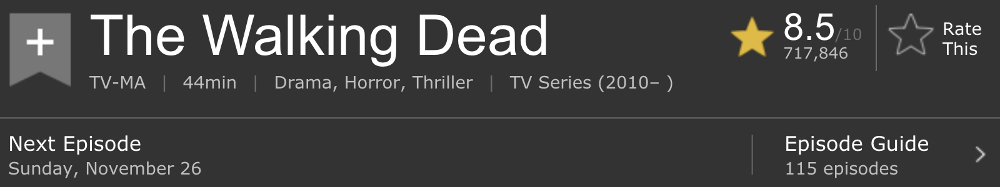

```{r setup, include=FALSE}
# R options
options(
  htmltools.dir.version = FALSE, # for blogdown
  show.signif.stars = FALSE,     # for regression output
  warm = 1
  )
# Set dpi and height for images
library(knitr)
opts_chunk$set(fig.height = 2.65, dpi = 300) 
# ggplot2 color palette with gray
color_palette <- list(gray = "#999999", 
                      salmon = "#E69F00", 
                      lightblue = "#56B4E9", 
                      green = "#009E73", 
                      yellow = "#F0E442", 
                      darkblue = "#0072B2", 
                      red = "#D55E00", 
                      purple = "#CC79A7")
# For nonsese...
library(emo)
```

```{r echo=FALSE, message=FALSE, warning=FALSE}
library(tidyverse)
library(rvest)
```

class: center, middle

# Getting started

---

## Getting started

- Final project assignment and the rest of the semester

- Will catch up on any remaining grading over the break

- Any questions from last time?

---

class: center, middle

# Functions

---

## 

```{r}
library(tidyverse)
library(rvest)

st <- read_html("http://www.imdb.com/title/tt4574334/?pf_rd_m=A2FGELUUNOQJNL&pf_rd_p=2240084122&pf_rd_r=1KS3NCRE9SZJ5NTFZAFD&pf_rd_s=center-1&pf_rd_t=15506&pf_rd_i=tvmeter&ref_=chttvm_tt_1")
twd <- read_html("http://www.imdb.com/title/tt1520211/?pf_rd_m=A2FGELUUNOQJNL&pf_rd_p=2240084122&pf_rd_r=1KS3NCRE9SZJ5NTFZAFD&pf_rd_s=center-1&pf_rd_t=15506&pf_rd_i=tvmeter&ref_=chttvm_tt_2")
got <- read_html("http://www.imdb.com/title/tt0944947/?pf_rd_m=A2FGELUUNOQJNL&pf_rd_p=2240084122&pf_rd_r=1KS3NCRE9SZJ5NTFZAFD&pf_rd_s=center-1&pf_rd_t=15506&pf_rd_i=tvmeter&ref_=chttvm_tt_3")
```


---

## Why functions?

- Automate common tasks in a power powerful and general way than copy-and-pasting:
    - You can give a function an evocative name that makes your code easier to understand.
    - As requirements change, you only need to update code in one place, instead of many.
    - You eliminate the chance of making incidental mistakes when you copy and paste (i.e. updating a variable name in one place, but not in another).
    
- Down the line: Improve your reach as a data scientist by writing functions (and packages!) that others use

is to write functions. Functions allow you to automate common tasks in a more powerful and general way than copy-and-pasting. Writing a function has three big advantages over using copy-and-paste:

---

## When should you write a function?

Whenever you’ve copied and pasted a block of code more than twice (i.e. you now have three copies of the same code).

<div class="question">
Do you see any problems in the code below?
</div>

.small[
```{r eval=FALSE}
st_episode <- st %>%
  html_nodes(".np_right_arrow .bp_sub_heading") %>%
  html_text() %>%
  str_replace(" episodes", "") %>%
  as.numeric()

got_episode <- got %>%
  html_nodes(".np_right_arrow .bp_sub_heading") %>%
  html_text() %>%
  str_replace(" episodes", "") %>%
  as.numeric()

twd_episode <- got %>%
  html_nodes(".np_right_arrow .bp_sub_heading") %>%
  html_text() %>%
  str_replace(" episodes", "") %>%
  as.numeric()
```
]

---

## Inputs

<div class="question">
How many inputs does the following code have?
</div>

```{r eval=FALSE}
st_episode <- st %>%
  html_nodes(".np_right_arrow .bp_sub_heading") %>%
  html_text() %>%
  str_replace(" episodes", "") %>%
  as.numeric()
```

---

## Turn your code into a function

1. Pick a **name**: Short but informative
2. List inputs, or **arguments**, to the function inside `function`. If we had more the call would look like `function(x, y, z)`.
3. You place the **code** you have developed in body of the function, a `{` block that immediately follows `function(...)`.

```{r}
scrape_episode <- function(x){
  x %>%
    html_nodes(".np_right_arrow .bp_sub_heading") %>%
    html_text() %>%
    str_replace(" episodes", "") %>%
    as.numeric()
}

scrape_episode(st)
```

---

## Check your function


```{r}
scrape_episode(twd)
```


```{r}
scrape_episode(got)
```

---

## Naming functions

> "There are only two hard things in Computer Science: cache invalidation and naming things." - Phil Karlton

- Names should be short but clearly evoke what the function does

- Names should be verbs, not nouns

- Multi-word names should be separated by underscores (`snake_case` as opposed to `camelCase`)

- A family of functions should be named similarly (`scrape_title`, `scrape_episode`, `scrape_genre`, etc.)

- Avoid overwriting existing (especially widely used) functions

---

## Scraping show info

.small[
```{r}
scrape_show_info <- function(x){

  title <- x %>%
    html_node("#title-overview-widget h1") %>%
    html_text() %>%
    str_trim()

  runtime <- x %>%
    html_node("time") %>%
    html_text() %>%
    str_replace("\\n", "") %>%
    str_trim()
  
  genres <- x %>%
    html_nodes(".txt-block~ .canwrap a") %>%
    html_text() %>%
    str_trim() %>%
    paste(collapse = ", ")
  
  show_info <- data_frame(title = title, runtime = runtime, genres = genres)
  return(show_info)
}
```
]

---

.small[
```{r}
scrape_show_info(st)
scrape_show_info(twd)
scrape_show_info(got)
```
]

---

## Let's take things one step back

```{r}
st_url <- "http://www.imdb.com/title/tt4574334/?pf_rd_m=A2FGELUUNOQJNL&pf_rd_p=2240084122&pf_rd_r=1KS3NCRE9SZJ5NTFZAFD&pf_rd_s=center-1&pf_rd_t=15506&pf_rd_i=tvmeter&ref_=chttvm_tt_1"
twd_url <- "http://www.imdb.com/title/tt1520211/?pf_rd_m=A2FGELUUNOQJNL&pf_rd_p=2240084122&pf_rd_r=1KS3NCRE9SZJ5NTFZAFD&pf_rd_s=center-1&pf_rd_t=15506&pf_rd_i=tvmeter&ref_=chttvm_tt_2"
got_url <- "http://www.imdb.com/title/tt0944947/?pf_rd_m=A2FGELUUNOQJNL&pf_rd_p=2240084122&pf_rd_r=1KS3NCRE9SZJ5NTFZAFD&pf_rd_s=center-1&pf_rd_t=15506&pf_rd_i=tvmeter&ref_=chttvm_tt_3"
```

---

<div class="question">
How would you update the following function to use the URL of the page as an argument?
</div>

.small[
```{r eval=FALSE}
scrape_show_info <- function(x){

  title <- x %>%
    html_node("#title-overview-widget h1") %>%
    html_text() %>%
    str_trim()

  runtime <- x %>%
    html_node("time") %>%
    html_text() %>%
    str_replace("\\n", "") %>%
    str_trim()
  
  genres <- x %>%
    html_nodes(".txt-block~ .canwrap a") %>%
    html_text() %>%
    str_trim() %>%
    paste(collapse = ", ")
  
  show_info <- data_frame(title = title, runtime = runtime, genres = genres)
  return(show_info)
}
```
]

---

.small[
```{r}
scrape_show_info <- function(x){
  
  y <- read_html(x)

  title <- y %>%
    html_node("#title-overview-widget h1") %>%
    html_text() %>%
    str_trim()

  runtime <- y %>%
    html_node("time") %>%
    html_text() %>%
    str_replace("\\n", "") %>%
    str_trim()

  genres <- y %>%
    html_nodes(".txt-block~ .canwrap a") %>%
    html_text() %>%
    str_trim() %>%
    paste(collapse = ", ")
  
  show_info <- data_frame(title = title, runtime = runtime, genres = genres)
  return(show_info)
}
```
]

---

## Let's check

.small[
```{r}
scrape_show_info(st_url)
scrape_show_info(twd_url)
scrape_show_info(got_url)
```
]

---

class: center, middle

# Automation

---

<div class="question">
You now have a function that will scrape the relevant info on shows given its URL. Where can we get a list of URLs of top 100 most popular TV shows on IMDB? Write the code for doing this in your teams.
</div>

---

```{r}
show_urls <- read_html("http://www.imdb.com/chart/tvmeter") %>%
  html_nodes(".titleColumn a") %>%
  html_attr("href") %>%
  paste("http://www.imdb.com", ., sep = "") # dot = outout of previous line
```

```{r echo=FALSE}
show_urls
```

---

## Go to each page, scrape show info 

Now we need a way of programatically directing R to each page on the `show_urls` list and running the `scrape_show_info` function on that page.

.small[
```{r}
scrape_show_info(show_urls[1])
scrape_show_info(show_urls[2])
scrape_show_info(show_urls[3])
```
]


---

## Go to each page, scrape show info 

In other words, we want to **map** the `scrape_show_info` function to each element of `show_urls`:

```{r eval=FALSE}
top_100_shows <- map_df(show_urls, scrape_show_info)
```


---